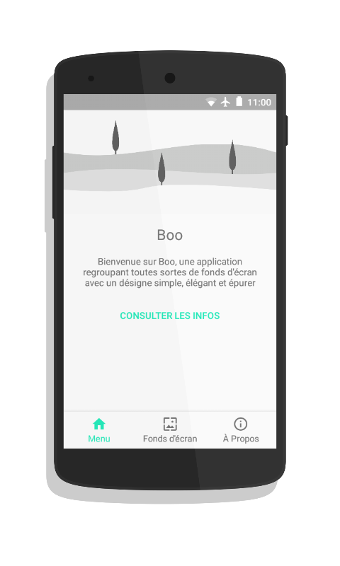
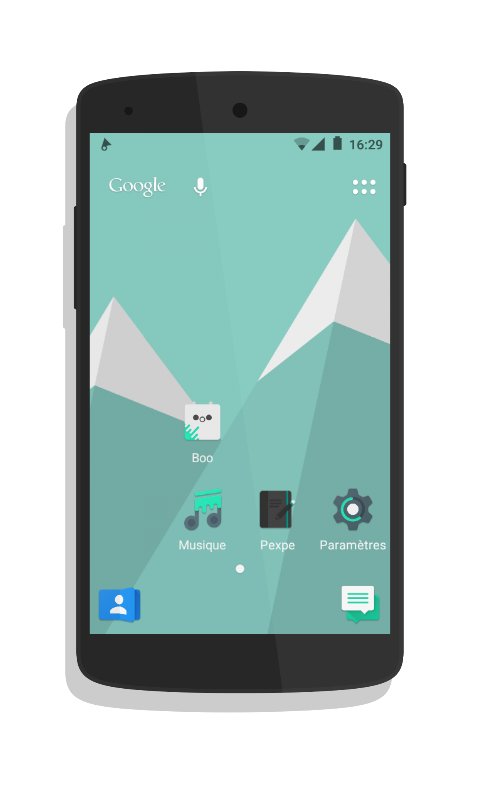
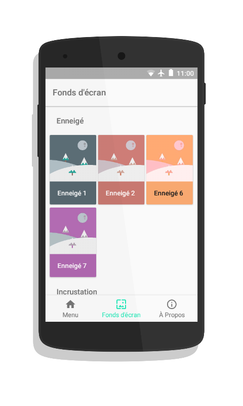

# Boo


### Description
Welcome to Boo, an application grouping all kinds of wallpapers with a simple, elegant and refined design

### Screenshots




### Translation
For translate the application [Translate Boo](https://meclotyoann.oneskyapp.com/admin/project/dashboard/project/126985)

# More
READ BEFORE CREATING A NEW BUG REPORT!

Take the time to check the problems you encountered with Boo.

Bug reports will be ignored if they do not include the following information: Device name, version number of Boo, and Android version name (including ROM Custom).

This is the second official repository of Boo, your can report your bug reports in the problems section.


 # License

```
Copyright 2017 MSay2

Licensed to the Apache Software Foundation (ASF) under one or more contributor
license agreements. See the NOTICE file distributed with this work for
additional information regarding copyright ownership. The ASF licenses this
file to you under the Apache License, Version 2.0 (the "License"); you may not
use this file except in compliance with the License. You may obtain a copy of
the License at

http://www.apache.org/licenses/LICENSE-2.0

Unless required by applicable law or agreed to in writing, software
distributed under the License is distributed on an "AS IS" BASIS, WITHOUT
WARRANTIES OR CONDITIONS OF ANY KIND, either express or implied. See the
License for the specific language governing permissions and limitations under
the License.
```
